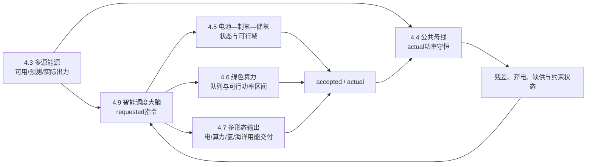

# 4.3—4.7模型整合与公共接口冻结建议

`common_case_v1`作为4.1冻结表的机器可读附件：4.1冻结字段、责任人和当前值，MATLAB/Python实际读取同一份`.mat/.yaml + 时序CSV`。

## 一、4.1中“公共原型场景冻结区”

建议采用两层数据，但只有一个公共参数包：

- `interface_smoke`：用于4.3—4.7接口联调，不形成工程经济结论。
- `engineering_base`：用于8760小时、经济性和方案比较；取得场址及企业数据后替换。

### 建议冻结内容

| 冻结项         | `common_case_v1`建议口径                                     | 责任模块         | 当前状态                   |
| -------------- | ------------------------------------------------------------ | ---------------- | -------------------------- |
| 参数集标识     | `caseId=common_case_v1`，所有结果必须携带该标识              | 4.1/模型总控     | 可冻结                     |
| 场景类型       | `interface_smoke`或`engineering_base`，每次运行只能选择一个  | 4.1              | 可冻结                     |
| 参考场址       | 一个场址、一个登陆点、一个公共母线拓扑；具体经纬度待项目确定 | 项目组           | P0待决策                   |
| 调度时区       | `Asia/Shanghai`，时段定义为\([t,t+\Delta t)\)                | 4.1              | 可冻结                     |
| 源侧装机       | 联调阶段暂沿用4.3现有34 MW风电＋4 MW光伏＋2 MW潮流能，共40 MW | 4.3提出、4.1冻结 | `[现有代码假设值]`         |
| 电池容量       | `bessPowerMW`、`bessEnergyMWh`必须给值；由4.5容量配置确定    | 4.5              | P0待补                     |
| 电解槽与储氢   | `electrolyzerMW`、`h2TankKg`、SEC及初始库存必须给值          | 4.5              | P0待补                     |
| 算力规模       | `dcFacilityMW`、IT容量、基础负荷和任务队列参数               | 4.6              | P0待补                     |
| 海缆与输出通道 | 送端容量、受端接纳、距离、损耗模型、既有/新建标识            | 4.7              | P0待补                     |
| 设备可用率     | 使用统一的逐时状态/降额序列，不允许各方案独立随机生成        | 4.3—4.7          | 可冻结方法                 |
| 初始状态       | SOC、储氢量、算力队列、设备启停状态                          | 4.5/4.6          | P0待补                     |
| 经济日历       | 币值基准年建议2026年；投运年记为`Y0`，待工程进度确定         | 财务组           | `[假设值，待校准]`         |
| 评价寿命       | 建议公共分析期25年                                           | 4.1/财务组       | `[假设值，待企业调研校准]` |
| 随机种子       | 联调场景统一固定种子，保证方案可复现                         | 模型总控         | 可冻结                     |
| 参数完整性     | 缺少P0参数时禁止运行`engineering_base`，不能自动使用模块默认值 | 模型总控         | 可冻结                     |

### 推荐文件结构

```
4.1边界与口径/
├─ 蓝海枢纽_4.1边界与口径冻结表_V1.1.docx
└─ common_case_v1/
   ├─ common_case_v1.yaml       # 静态参数、容量、口径、版本
   ├─ source_timeseries.csv     # 4.3资源与出力
   ├─ availability.csv          # 全模块设备状态
   ├─ demand_and_price.csv      # 负荷、需求、价格
   ├─ initial_state.yaml        # SOC、储氢、队列等
   └─ common_case_v1.mat        # MATLAB读取版本
```

模块内部的默认参数只能用于单元测试；联合运行必须由`common_case_v1`覆盖。

------

## 二、测点与功率正方向具体冲突

### 1. 当前冲突在哪里

4.3输出的`pActualAtPOI`：

- 单位为W；
- 位于源侧汇集点；
- 已扣除集电损耗；
- 源侧辅机`pAuxLoad`尚未扣除，作为独立负荷送入4.4。

4.4按照这一约定，将源侧实际注入作为正值，同时再扣一次`pSourceAuxLoad`。这部分逻辑是自洽的。

但4.5直接读取`wind_power_mw`，没有说明它是：

- 设备毛功率；
- 扣除集电损耗后的MP-03功率；
- 还是扣除源侧辅机后的母线净功率。

同时4.5又自行扣除`critical_load_mw`、决定外送和弃电，导致其测点跨越了4.3和4.4。

4.7的`available_power_mw`同样没有显式测点，并建立了另一套系统平衡；其海缆模型中的：

- `exported_power_mw`是海缆送端；
- `delivered_power_mw`是陆上受端。

如果把`delivered_power_mw`误接回4.4，就会把海缆损耗提前扣除。

### 2. 建议冻结测点

| 测点               | 含义                                         | 责任模块 |
| ------------------ | -------------------------------------------- | -------- |
| `MP-DEVICE`        | 风机、光伏或潮流能设备电气端毛功率           | 单源模型 |
| `MP-03-SOURCE-POI` | 扣除源侧集电损耗后的多源汇集功率             | 4.3      |
| `MP-04-COMMON-BUS` | 储能、制氢、算力、外送等共同连接的功率平衡点 | 4.4      |
| `MP-CABLE-SEND`    | 海缆海上送端                                 | 4.7      |
| `MP-CABLE-RECEIVE` | 陆上受端/结算点                              | 4.7      |
| `MP-DC-FACILITY`   | 数据中心设施总用电入口                       | 4.6      |
| `MP-ELECTROLYZER`  | 电解制氢系统用电入口                         | 4.5      |
| `MP-H2-DELIVERY`   | 管道/船运损耗后的氢产品交付点                | 4.7      |

### 3. 建议正方向

优化模型优先使用两个非负电池变量：

\[$P_t^{BESS,ch}\geq0,\qquad P_t^{BESS,dis}\geq0$\]

避免在不同语言中对正负号产生误解。接口需要单一净功率时再定义：

\[$P_t^{BESS,net}=P_t^{BESS,dis}-P_t^{BESS,ch}$\]

其中正值表示向公共母线放电。

其他端口均使用非负幅值：

- `pSourceActual`：正注入；
- `pExportSend`、`pElectrolyzer`、`pDCFacility`、`pMarine`：正消耗；
- `pGridImport`：正注入；
- `pSpill`：正消耗；
- `pUnserved`：可靠性统计量，不进入实际已服务负荷。

每个可控端口统一保留：

```
requested → accepted → actual
```

4.4只使用`actual`做最终平衡。

------

## 三、损耗与辅机由哪一小节负责

| 损耗/辅机项目                          | 唯一责任小节     | 进入4.4的方式                      |
| -------------------------------------- | ---------------- | ---------------------------------- |
| 风机阵列、光伏场内电缆、潮流能集电损耗 | 4.3              | 已从毛功率中扣除，不再作为4.4负荷  |
| 风机、光伏、潮流能设备辅机             | 4.3计算，4.4记账 | `pSourceAuxLoad`独立负荷，仅扣一次 |
| 公共升压、变换、母线及岛级公用系统损耗 | 4.4              | `pPostPOILoss`、`pCommonAux`       |
| 电池充放电效率损耗                     | 4.5              | 体现在SOC状态方程，不在4.4再次扣除 |
| 电解槽SEC及制氢BOP                     | 4.5              | 统一折算为`pElectrolyzerActual`    |
| 压缩、纯化、储氢循环能耗               | 原则上4.5        | 若SEC已包含，禁止再单列            |
| IT设备用电                             | 4.6              | 形成`pIT`                          |
| 冷却、泵、网络、存储及算力辅助用电     | 4.6              | 与IT合成`pDCFacility`              |
| 海缆输电损耗                           | 4.7              | 送端功率进入4.4，受端电量用于收益  |
| 管道和船运氢损耗                       | 4.7              | 只影响最终交付量，不影响4.5产氢量  |
| 海洋用能设备自身电耗                   | 4.7              | 作为`pMarineActual`进入4.4         |

必须纠正的重叠：

- 4.7不能再次根据PUE从设施功率重算IT功率，应直接读取4.6输出；
- 4.7不能再次根据电解功率计算产氢和储氢状态，应读取4.5输出；
- `marine.aux_load`必须明确是海洋服务负荷，不能与4.3源侧辅机或4.4公共辅机重名。

------

## 四、统一时间尺度

建议在4.1冻结以下四层：

| 层级         | 统一步长 | 主要模块        | 用途                                   |
| ------------ | -------- | --------------- | -------------------------------------- |
| 原始源侧仿真 | 5 min    | 4.3             | 风光潮波动、状态机、预测误差           |
| 主调度层     | 1 h      | 4.3—4.9         | 168 h/8760 h联合运行、经济性和容量评价 |
| 日内精细校核 | 15 min   | 4.3—4.7         | 爬坡、短时储能和柔性负荷校核           |
| 构网动态层   | ≤1 s     | 4.4/4.5动态模型 | 频率、电压、虚拟惯量、故障和黑启动     |

以上均属于`[项目建模假设，待调度及设备数据校准]`。

### 聚合规则

- 5分钟功率转1小时：按电量守恒求平均功率；
- 电量、产氢量、服务量：求和；
- SOC、氢库存、算力队列：使用时段末状态；
- 可用率：按实际可用时长或状态方程处理；
- 停机、故障、复归：保留事件标签，不线性插值；
- 最大/最小功率、爬坡：分别保存极值，不能只保存平均值；
- 价格、需求：按其原始结算口径聚合。

联合模型主入口统一读取1小时序列；5分钟和秒级模型只承担校核与参数回灌。

------

## 五、统一基准方案口径

### 1. 场址

主基准只能采用一个参考场址：

- 同一海域；
- 同一水深和离岸距离；
- 同一登陆点；
- 同一公共平台拓扑；
- 同一海缆路径长度。

场址未确定前可使用`SITE_REF_V1`虚拟参考场址，但必须标注：

> `[假设场址，仅用于模型联调，不形成工程投资结论]`

### 2. 资源时序

所有比较方案使用同一套同步资源数据：

- 同一个代表年；
- 同一风速、辐照、潮流和海况时序；
- 同一时间戳和时区；
- 同一缺测处理方法；
- 同一预测误差场景。

不能为不同方案分别随机生成更有利的资源曲线。

### 3. 设备可用率

建议把可用率拆成逐时外生序列：

```
availabilityState(t)
derateFactor(t)
maintenanceCode(t)
failureCode(t)
```

“单一外送”和“源储算用协同”必须共享同一源侧故障与检修序列。新增电池、电解槽、算力和输出通道分别使用自己的状态序列，但随机种子固定。

### 4. 投运年与寿命

建议冻结：

- 币值基准年：2026年；
- 投运年：`Y0`，待工程进度确定；
- 主评价期：25年；
- 建设期现金流与运营期现金流分开；
- 各设备更换周期单独设置，不通过缩短整个项目寿命处理。

以上均为：

> `[假设值，待项目进度、设备设计寿命及融资条件校准]`

### 5. 源侧装机由谁决定

建议治理关系为：

1. 4.3根据场址资源、国产设备和多源互补性提出候选装机组合；
2. 4.9在容量规划模式下比较候选组合；
3. 项目组选择一个基准组合；
4. 4.1将其冻结到`common_case_v1`；
5. 运营调度比较中，所有方案保持相同源侧装机。

因此，不建议让4.3在每次联合运行时动态改变装机容量。

当前接口联调可暂时冻结：

\[34\text{ MW风电}+4\text{ MW光伏}+2\text{ MW潮流能}\]

来源类型：`[现有公共基线代码假设值，待工程尺度校准]`。

正式工程基准仍应保持“漂浮式风电85%+、漂浮式光伏互补、潮流/波浪能预留”的项目定位，但具体比例由场址与优化结果决定。

### 6. 海缆既有/新建由谁决定

4.7负责提供：

- 海缆技术方案；
- 送端容量；
- 受端接纳；
- 距离与损耗模型；
- CAPEX/OPEX模型；
- 既有/新建两类场景参数。

但“使用哪一种作为主基准”应由4.1冻结，不能由4.7自行改变。

建议设置两套比较：

#### 主比较：绿地新建口径

两个方案均视为新建项目：

- 相同场址、距离和登陆点；
- 使用同一海缆成本函数；
- 单一外送方案可优化其海缆容量；
- 源储算用方案也可优化较小海缆与其他输出通道的组合。

这套比较能够体现减少海缆容量投资是否构成能源岛价值。

#### 辅助比较：既有海缆口径

两个方案均使用同一条既有海缆：

- 容量和损耗相同；
- 已发生CAPEX作为沉没成本，不计入两方案增量比较；
- 只比较运营收益、弃电、可靠性和新增设备投资。

禁止出现“单一外送按新建海缆、协同方案按既有海缆”的混合比较。

## 4.1的最终冻结

> 4.3提出并校准源侧装机，4.1冻结公共基准容量；4.7提供海缆既有/新建场景模型，4.1冻结主比较口径；4.3—4.7统一读取`common_case_v1`，任何模块不得在联合运行时使用自己的默认容量、时间轴、场址、可用率或经济日历。当前40 MW源侧及25年评价期均为`[假设值，待企业调研校准]`。



